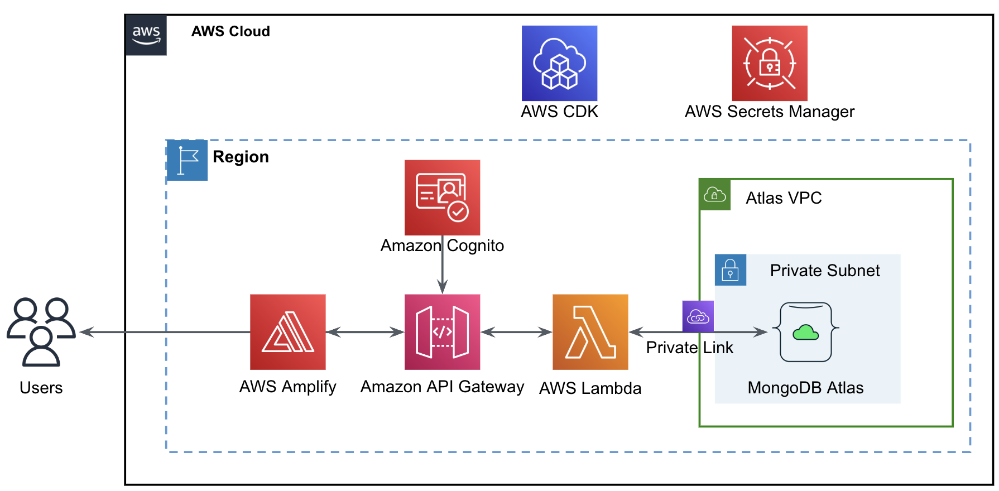

# Accelerate Application Modernization: Low Code Application Development with AWS Amplify, AppSync, and MongoDB Atlas

In today’s fast-paced digital landscape, turning innovative ideas into fully functional applications quickly and efficiently is essential for developers, startups, and business consultants. This repository is designed to empower you to do just that. By leveraging AWS Amplify for seamless front-end development, AppSync for robust and scalable backend services, and MongoDB Atlas for a flexible and powerful database solution, it offers a comprehensive, low-code solution that drastically reduces development time while maintaining high standards of performance and scalability.

This repository provides a starter template for building applications with React+Vite and AWS Amplify, seamlessly connecting to MongoDB Atlas. It simplifies the setup for authentication, API integration, and database capabilities. With a foundational React application pre-integrated with AWS Amplify, this template is optimized for scalability and performance, making it perfect for developers, startups, and business consultants seeking to jumpstart their projects with pre-configured AWS services like Cognito, AppSync, and MongoDB Atlas


## AWS Amplify
[AWS Amplify](https://aws.amazon.com/amplify) is a comprehensive development platform that simplifies the creation of full-stack applications with minimal configuration. It provides a set of tools and services that integrate seamlessly with popular frameworks like React, Angular, and Vue, enabling developers to easily set up scalable backends, manage authentication, and deploy applications with a few simple commands. The 2.0 features of AWS Amplify enhance support for CI/CD workflows, improve the developer experience with the Amplify CLI, and expand capabilities for backend infrastructure as code. These updates facilitate easier management and deployment of cloud resources, integration of serverless functions, and connection to MongoDB Atlas data sources through AWS AppSync and DataAPI, thus significantly reducing the time and effort required to build and scale modern applications

## AWS AppSync
[AWS AppSync](https://aws.amazon.com/appsync/) is a fully managed service that simplifies the development of GraphQL APIs by automatically handling data fetching, real-time updates, and offline synchronization. It seamlessly integrates with various data sources, including MongoDB Atlas through DataAPI and Drivers, allowing developers to build scalable and flexible applications with ease. AppSync’s features include built-in support for real-time data updates and offline access, reducing the complexity of managing data interactions and enhancing application performance

## MongoDB Atlas

[MongoDB Atlas](https://www.mongodb.com/products/platform/atlas-database) is a fully managed cloud database service known for its operational excellence and scalability. It offers advanced features like automated backups, scaling, and monitoring, ensuring high availability and performance. Notably, Atlas includes Vector Search capabilities, which are optimized for Generative AI use cases, enabling efficient search and retrieval of high-dimensional data. This feature enhances the ability to perform complex queries and data analysis, making it ideal for applications requiring sophisticated data interactions and AI-driven insights

## Reference Architecture 




## Prerequisites

MongoDB Atlas

AWS Account


## Features

- **Authentication**: Setup with Amazon Cognito for secure user authentication.
- **API**: Ready-to-use GraphQL endpoint with AWS AppSync.
- **Database**: Real-time database powered by MongoDB Atlas.


## Deploying to AWS

### Step 1

#### Set up the MongoDB Atlas cluster

Follow the link to the setup the MongoDB Atlas cluster, Database , User and Network access


#### Set up the DATA API with API Key

Follow the link to the setup the Data API


### Step 2

Clone the GitHub Repository

``` git clone https://github.com/mongodb-partners/amplify_appsync_mongodb_atlas_startup.git```

### Step 3

Setup the AWS CLI credentials

``` aws configure ```

### Step 4

#### Deploy the To-do Application in AWS Amplify


Open the AWS Amplify console and Select the Github Option 


Configure the GitHub Repository


Select the GitHub Repository and click Next


Set all other options to default and deploy


#### Configure the Environment Variables

Configure the Environment variables after the successful deployment


#### open the application and test

Open the application through the URL provided and test the application.


MongoDB Atlas Output


#### Troubleshoot

In the developer IDE we can create a sandbox environment to test the application code.

Configure the AWS CLI environment

```
export AWS_ACCESS_KEY_ID=
export AWS_SECRET_ACCESS_KEY=
export AWS_SESSION_TOKEN=
```

Set the enviornment variables for the following

```
export ATLAS_DATA_API_PATH=
export MONGODB_DATA_API_KEY=
export COLLECTION=
export DATABASE=
export DATASOURCE=
export ATLAS_DATA_API_REGIONAL_ENDPOINT=

```

Build the Sandbox environment

`npx ampx sandbox`

On Successful build, open another shell and set the AWS Environment varibales

```
export AWS_ACCESS_KEY_ID=
export AWS_SECRET_ACCESS_KEY=
export AWS_SESSION_TOKEN=
```

Run the Application 

`npm run dev`

Output:

```
  VITE v5.2.11  ready in 174 ms

  ➜  Local:   http://localhost:5173/
  ➜  Network: use --host to expose
  ➜  press h + enter to show help

  ```

Open the webpage on the localhost and test the application.


## Useful Link

For detailed instructions on deploying your application, refer to the [deployment section](https://docs.amplify.aws/react/start/quickstart/#deploy-a-fullstack-app-to-aws) of our documentation.

## Contributing


## License


## Conclusion
In conclusion, this GitHub repository provides a comprehensive solution for accelerating application modernization through low-code development with AWS Amplify, AppSync, and MongoDB Atlas. By leveraging the power of these technologies, developers, startups, and business consultants can quickly and efficiently build scalable and performant applications. With pre-configured authentication, API integration, and real-time database capabilities, this starter template simplifies the development process and reduces time to market. Whether you're a seasoned developer or just starting out, this repository is a valuable resource for jumpstarting your projects and leveraging the full potential of AWS services. Start building your next application today!